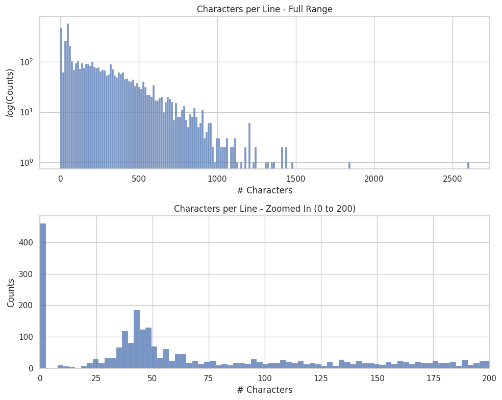
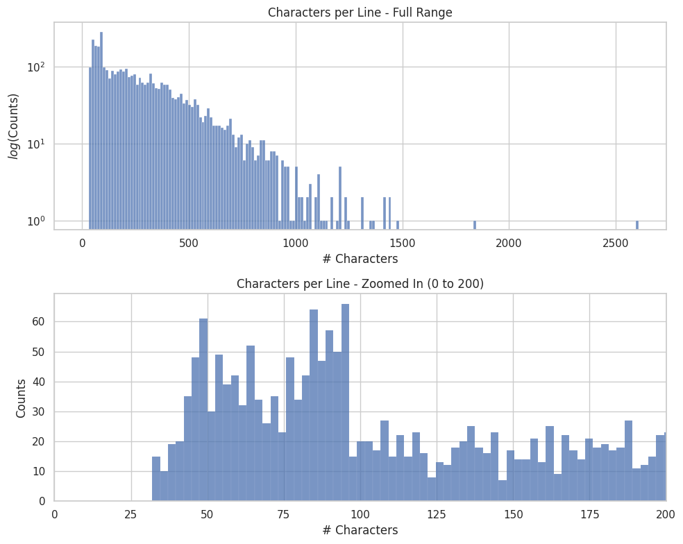
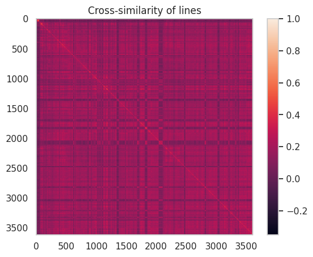
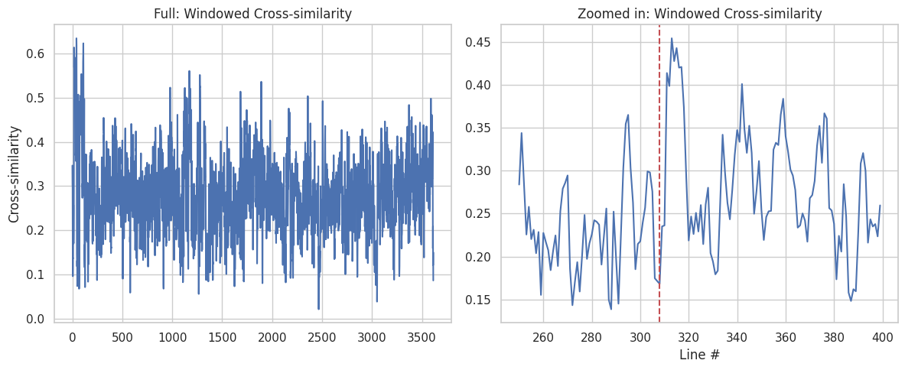
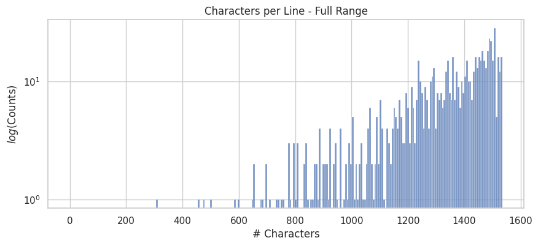

# Semantic Splitting with WordLlama
2024-10-03

## TLDR

Split text like "The Lord of the Rings" in ~750ms, incorporating semantic similarity.

## Why spend so much effort on splitting?

When splitting/chunking text for Retrieval-Augmented Generation (RAG) applications, the goal is to avoid breaking apart complete ideas or topics. Here's a progression of standard splitting methods:

1. Fixed character count: Splits on a set number of characters, even breaking words.
2. Word-aware splitting: Forms splits of approximate character counts without breaking words.
3. Sentence-level splitting: Breaks only at sentence boundaries, sacrificing some consistency in chunk sizes.
4. Paragraph-level splitting: Maintains paragraph integrity but may result in highly variable chunk sizes.

These methods don't require language modeling, but they lack semantic awareness. More advanced techniques using language models can provide better semantic coherence but typically at a significant computational cost and latency. And, although semantic splitting is conceptually simple, it still involves multiple steps to refine a quality algorithm.

WordLlama is a good platform for accomplishing this, since it can incorporate basic semantic information into the chunking process, without adding significant computational requirements. Here, we develop a recipe for semantic splitting with WordLlama using an intuitive process. 

## Target texts

We focus on chunking for information retrieval and RAG applications. For these use cases, text chunks typically consist of 256-2048 tokens. Input texts can vary widely, including:

- Long-form articles or blog posts
- Academic papers or research reports
- Books or book chapters
- Legal documents or contracts
- Technical documentation or manuals
- Transcripts from interviews, speeches, or conversations

The challenge lies in maintaining semantic coherence across diverse text types and lengths while producing consistently sized chunks.

## Method Overview

Our process involves three main steps:

1. `split`: Divide the original text into small chunks.
2. `embed`: Generate embeddings for each chunk.
3. `reconstruct`: Combine chunks based on similarity information up to target sizes

The algorithm aims to:

1. Maximize information continuity, keeping related concepts and ideas together
2. Produce consistent chunk sizes
3. Maintain high performance with low computational requirements

### Split

The initial split divides the text into smaller units, typically at the paragraph level and at the sentence level when paragraphs exceed the target sizes. This step ensures that the basic grammatical structures remain intact, which is a simple way to preserve semantic information without language models.

### Embed

Each chunk is embedded using WordLlama. It offers a good balance between semantic representation and computational efficiency.

### Reconstruct

The reconstruction step checks the similarity between adjacent chunks using their embeddings. It uses this information to make better decisions about where to place chunk boundaries:

- Keep semantically similar content together
- Avoid splitting in the middle of ideas
- Form chunks of consistent sizes

Using WordLlama embedding with efficient algorithms, this process can handle large texts quickly, making it suitable for various applications and computational environments.


### Load The Lord of the Rings Text


```python
import chardet

filename = "lotr_fellowship.txt"
with open(filename, "rb") as file:
    raw_data = file.read()
    result = chardet.detect(raw_data)
    encoding = result['encoding']

with open(filename, "r", encoding=encoding) as file:
    text = file.read()

print(text[0:300])
```

    J. R. R. Tolkien — The Lord Of The Rings. (1/4)
    -----------------------------------------------
    
    
         THE LORD OF THE RINGS
    
                  by
    
         J. R. R. TOLKIEN
    
    
    
     Part 1: The Fellowship of the Ring
     Part 2: The Two Towers
     Part 3: The Return of the King
    
    
    _Complete with Index and Full Appendi


## Step 1: Split

First let's see what we get from a simple `splitlines()`

### Plot Helper


```python
import matplotlib.pyplot as plt
import seaborn as sns

def plot_chars(chars_per_line):
    sns.set(style="whitegrid")
    fig, axes = plt.subplots(2, 1, figsize=(10, 8))
    
    # First plot: full range
    sns.histplot(chars_per_line, bins=200, ax=axes[0], kde=False)
    axes[0].set_title("Characters per Line - Full Range")
    axes[0].set_xlabel("# Characters")
    axes[0].set_ylabel("$log($Counts$)$")
    axes[0].semilogy(True)
    
    # Second plot: zoomed-in range
    sns.histplot(chars_per_line, bins=1000, ax=axes[1], kde=False)
    axes[1].set_title("Characters per Line - Zoomed In (0 to 100)")
    axes[1].set_xlabel("# Characters")
    axes[1].set_ylabel("Counts")
    axes[1].set_xlim((0, 200))
    
    plt.tight_layout()
    plt.show()
```


```python
# Split the text into lines
lines = text.splitlines()

# Calculate the number of characters per line
chars_per_line = list(map(len, lines))

plot_chars(chars_per_line)
```


    

    


Here we can see a bunch of small fragments with close to zero size. Additionally, there are some smaller segments below 50 characters. While most of the chunks are fewer than 1k characters, there are a few larger ones as well. The chunks that are a few characters or less are not likely to carry much semantic information and are disproportionate compared to most of the other segments.

### Constrained Coalesce

I started with `constrained_batches()` from `more-itertools`, which is a nice batching algorithm for gathering texts. However, it is a "greedy" algorithm that combines from left to right until a batch would exceed a given constraint by batching with the next item. This can leave the last batch as a small fragment compared to the constraint size, and is very likely to sandwich the fragments between larger sections.

To address this, I added a similar idea, but with "coalesce" style combination. This does recursive neighbor to neighbor batching up to the constraint size, so that more consistent batch sizes are produced. The result is that the combined segments do not typically hit the max size, but also the smallest fragments are not as small.


```python
import string
from wordllama.algorithms.splitter import constrained_coalesce, constrained_batches, reverse_merge


letters = list(string.ascii_lowercase)

# using constrained coalesce
constrained_coalesce(letters, max_size=5, separator="")
```


    ['abcd', 'efgh', 'ijkl', 'mnop', 'qrst', 'uvwx', 'yz']


```python
# using constrained batches
list(map("".join, constrained_batches(letters, max_size=5)))
```


    ['abcde', 'fghij', 'klmno', 'pqrst', 'uvwxy', 'z']


In the coalesce algorithm, we prioritize consistent chunk sizes, which is more beneficial for embedding comparisons. We also add a `reverse_merge` operation which more forcibly merges anything below a certain number of characters `n`
with the previous string in the list.


```python
# Split the text into lines
lines = text.splitlines()
lines = constrained_coalesce(lines, max_size=96, separator="\n")
lines = reverse_merge(lines, n=32, separator="\n")

# Calculate the number of characters per line
chars_per_line = list(map(len, lines))

plot_chars(chars_per_line)
```


    

    


This is better. Let's take care of the larger segments.

We need to import a function to do sentence splitting. First we'll split the large paragraphs and then recombine them back to a smaller size. If we have to split a paragraph, it's probably best to keep localized sections of it together with other sentences in the split.

We'll need to have a target size. 1536 chars is a good number for 512 token width models. We also reverse merge to clean up before moving on.


```python
from itertools import chain
from typing import List
from wordllama.algorithms.splitter import split_sentences

def flatten(nested_list: List[List]) -> List:
    return list(chain.from_iterable(nested_list))

def constrained_split(
    text: str,
    target_size: int,
    separator: str = " ",
) -> List[str]:
    sentences = split_sentences(text)
    sentences = constrained_coalesce(sentences, target_size, separator=separator)
    sentences = reverse_merge(sentences, n=32, separator=" ")
    return sentences
```


```python
TARGET_SIZE = 1536
MAX_CHUNK = 512

# Split the text into lines
lines = text.splitlines()
lines = constrained_coalesce(lines, max_size=96, separator="\n")
lines = reverse_merge(lines, n=32, separator="\n")

results = []
# break chunks above target size into
# sentences and combine into medium sized chunks
for line in lines:
    if len(line) > TARGET_SIZE:
        sentence_chunks = constrained_split(line, MAX_CHUNK, separator=" ")
    else:
        sentence_chunks = [line]
    results.extend(sentence_chunks)
lines = results


# Calculate the number of characters per line
chars_per_line = list(map(len, lines))

plot_chars(chars_per_line)
```


    

    


Now we have a more reasonable starting point for doing semantic splitting. Let's use wordllama to embed the segments into vectors, and compute similarity for all the segments.

## Step 2: Embedding


```python
from wordllama import WordLlama

wl = WordLlama.load()

# calculate the cross-similarity
embeddings = wl.embed(lines, norm=True)
xsim = wl.vector_similarity(embeddings, embeddings)

plt.imshow(xsim)
plt.grid(False)
plt.colorbar()
plt.title("Cross-similarity of lines")
```


    Text(0.5, 1.0, 'Cross-similarity of lines')


    

    


Here's where we can see how wordllama can help. As we traverse the diagonal, we can identify blocks of similar texts. The very small block in the upper left corner is the table of contents.

A windowed average should help with finding these blocks. The average should be high when the window spans a region of high similarity, and low between between similarity blocks. Instead of computing the full cross similarity, it makes more sense to compare localized text segments using a sliding window.


```python
from wordllama.algorithms.find_local_minima import windowed_cross_similarity

xsim = windowed_cross_similarity(embeddings, window_size=5)


fig, (ax1, ax2) = plt.subplots(1, 2, figsize=(12, 5))

im1 = ax1.plot(xsim)
ax1.set_title('Full: Windowed Cross-similarity')
ax1.set_ylabel("Cross-similarity")

ax2.plot(range(250, 400), xsim[250:400], 'b-')
ax2.set_title('Zoomed in: Windowed Cross-similarity')
ax2.set_xlabel('Line #')
ax2.axvline(308, ls="--", color="r")

plt.tight_layout()
plt.show()

```


    

    


With the size of our segments, even 10-20 segments is a decent chunk size. Here we can zoom in on the minimum around the **dashed red line index (308)**. 


```python
print("\n".join([lines[i] if i != 308 else f">>>>>>>>>>>>>{lines[i]}<<<<<<<<<<<<<" for i in range(305, 310)]))
```

         'Some people!' exclaimed Frodo. 'You mean Otho and Lobelia. How abominable! I would give them Bag End and everything else, if I could get Bilbo back and go off tramping in the country with him. I love the Shire. But I begin to wish, somehow, that I had gone too. I wonder if I shall ever see him again.'
         'So do I,' said Gandalf. 'And I wonder many other things. Good-bye now! Take care of yourself! Look out for me, especially at unlikely times! Good-bye!'
         Frodo saw him to the door. He gave a final wave of his hand, and walked off at a surprising pace; but Frodo thought the old wizard looked unusually bent, almost as if he was carrying a great weight. The evening was closing in, and his cloaked figure quickly vanished into the twilight. Frodo did not see him again for a long time.
    >>>>>>>>>>>>>
    
                               _Chapter 2_
                The Shadow of the Past
    <<<<<<<<<<<<<
         The talk did not die down in nine or even ninety-nine days. The second disappearance of Mr. Bilbo Baggins was discussed in Hobbiton, and indeed all over the Shire, for a year and a day, and was remembered much longer than that. It became a fireside-story for young hobbits; and eventually Mad Baggins, who used to vanish with a bang and a flash and reappear with bags of jewels and gold, became a favourite character of legend and lived on long after all the true events were forgotten.


### Avast, a chapter break!

Land Ho! Find the minima.

OMG, Savitzky-Golay do your thing. It's a smoothing filter with derivatives and zero phase shift. This filter is the basis of our `find_local_minima` algorithm, which looks for the roots of the first derivative (mins and maxes), and checks the sign of the second derivative to determine minima. It then interpolates between points to determine which index to split at.

The process goes like this:
1. Apply the Savitzky-Golay filter to calculate the first and second derivatives
2. Identify roots of the first derivative to find mins/maxes
3. Use the sign of the second derivative to distinguish minima
4. Interpolate  and round to find the best index for splitting

Last, we screen off everything above a percentile (e.g., 0.4), so we're just keeping minima at globally low similarity points. This ensures that we're only splitting at the most significant semantic boundaries.


```python
import numpy as np
from wordllama.algorithms.find_local_minima import find_local_minima

a,b = (250, 400)

results = find_local_minima(xsim, poly_order=2, window_size=3)

# filter below median
idx = np.where(results[1] < np.quantile(xsim, 0.4))

x = results[0][idx]
y = results[1][idx]

fig, (ax1, ax2) = plt.subplots(1, 2, figsize=(12, 5))

ax1.plot(xsim)
ax1.plot(x, y, "r.")
ax1.set_title('Full: Windowed Cross-similarity')
ax1.set_ylabel("Cross-similarity")

ax2.plot(range(a,b), xsim[a:b], 'b-')
zoom, = np.where((x < b) & (x >= a))
ax2.plot(x[zoom], y[zoom], "r*")

ax2.set_title('Zoomed in: Windowed Cross-similarity')
ax2.legend()
ax2.set_xlabel('Line #')

plt.tight_layout()
plt.show()

```

    /tmp/ipykernel_139729/2162431424.py:26: UserWarning: No artists with labels found to put in legend.  Note that artists whose label start with an underscore are ignored when legend() is called with no argument.
      ax2.legend()


    

    


Well that was fun. Now all that's left is to bring the sections back up to our target size.

Here, we can use batching functions we discussed previously, and take regions in between our semantic split points.

## Step 3: Reconstruction


```python
# reconstruct using the minima as boundaries for coalesce
# this ensures that any semantic boundaries are respected
chunks = []
start = 0
for end in x + [len(lines)]:
    chunk = constrained_coalesce(lines[start:end], TARGET_SIZE)
    chunks.extend(chunk)
    start = end

lines = list(map("".join, constrained_batches(lines, max_size=TARGET_SIZE, strict=False)))

# Calculate the number of characters per line
chars_per_line = list(map(len, lines))

# plotting
sns.set(style="whitegrid")
fig, ax = plt.subplots(1, 1, figsize=(10, 4))

sns.histplot(chars_per_line, bins=200, ax=ax, kde=False)
ax.set_title("Characters per Line - Full Range")
ax.set_xlabel("# Characters")
ax.set_ylabel("$log($Counts$)$")
ax.semilogy(True)
```


    [<matplotlib.lines.Line2D at 0x7f2fb8760e90>]


    

    


### Visualize


```python
from IPython.display import HTML, display

def display_strings(strings):
    """
    Display a list of strings in Jupyter notebook with custom styling.
    
    Args:
    strings (list): A list of strings to display.
    """
    html_content = """
    <style>
        .string-container {
            border: 2px solid navy;
            border-radius: 0px;
            overflow: hidden;
            margin-bottom: 10px;
        }
        .string-pane {
            padding: 10px;
            background-color: #E6F3FF;
        }
        .string-pane:not(:last-child) {
            border-bottom: 1px solid navy;
        }
        .string-pane:nth-child(even) {
            background-color: #CCE6FF;
        }
    </style>
    <div class="string-container">
    """
    
    for string in strings:
        html_content += f'<div class="string-pane">{string}</div>'
    
    html_content += "</div>"
    
    display(HTML(html_content))


display_strings(lines[500:505])
```


<style>
    .string-container {
        border: 2px solid navy;
        border-radius: 0px;
        overflow: hidden;
        margin-bottom: 10px;
    }
    .string-pane {
        padding: 10px;
        background-color: #E6F3FF;
    }
    .string-pane:not(:last-child) {
        border-bottom: 1px solid navy;
    }
    .string-pane:nth-child(even) {
        background-color: #CCE6FF;
    }
</style>
<div class="string-container">
<div class="string-pane">     ` "Yes, I have come," I said. "I have come for your aid, Saruman the White." And that title seemed to anger him.     ' "Have you indeed, Gandalf the _Grey_! " he scoffed. "For aid? It has seldom been heard of that Gandalf the Grey sought for aid, one so cunning and so wise, wandering about the lands, and concerning himself in every business, whether it belongs to him or not."     'I looked at him and wondered. "But if I am not deceived," said I, "things are now moving which will require the union of all our strength."     ' "That may be so," he said, "but the thought is late in coming to you. How long. I wonder, have you concealed from me, the head of the Council, a matter of greatest import? What brings you now from your lurking-place in the Shire? "     ' "The Nine have come forth again," I answered. "They have crossed the River. So Radagast said to me."     ` "Radagast the Brown! " laughed Saruman, and he no longer concealed his scorn. "Radagast the Bird-tamer! Radagast the Simple! Radagast the Fool! Yet he had just the wit to play the part that I set him. For you have come, and that was all the purpose of my message. And here you will stay, Gandalf the Grey, and rest from journeys. For I am Saruman the Wise, Saruman Ring-maker, Saruman of Many Colours! "     'I looked then and saw that his robes, which had seemed white, were not so, but were woven of all colours. and if he moved they shimmered and changed hue so that the eye was bewildered.     ' "I liked white better," I said.</div><div class="string-pane">     ' "White! " he sneered. "It serves as a beginning. White cloth may be dyed. The white page can be overwritten; and the white light can be broken."     ' "In which case it is no longer white," said I. "And he that breaks a thing to find out what it is has left the path of wisdom."     ' "You need not speak to me as to one of the fools that you take for friends," said he. "I have not brought you hither to be instructed by you, but to give you a choice."     'He drew himself up then and began to declaim, as if he were making a speech long rehearsed. "The Elder Days are gone. The Middle Days are passing. The Younger Days are beginning. The time of the Elves is over, but our time is at hand: the world of Men, which we must rule. But we must have power, power to order all things as we will, for that good which only the Wise can see.</div><div class="string-pane">     ' "And listen, Gandalf, my old friend and helper! " he said, coming near and speaking now in a softer voice. "I said we, for we it may be, if you will join with me. A new Power is rising. Against it the old allies and policies will not avail us at all. There is no hope left in Elves or dying Númenor. This then is one choice before you. before us. We may join with that Power. It would be wise, Gandalf. There is hope that way. Its victory is at hand; and there will be rich reward for those that aided it. As the Power grows, its proved friends will also grow; and the Wise, such as you and I, may with patience come at last to direct its courses, to control it. We can bide our time, we can keep our thoughts in our hearts, deploring maybe evils done by the way, but approving the high and ultimate purpose: Knowledge, Rule, Order; all the things that we have so far striven in vain to accomplish, hindered rather than helped by our weak or idle friends. There need not be, there would not be, any real change in our designs, only in our means."     ' "Saruman," I said, "I have heard speeches of this kind before, but only in the mouths of emissaries sent from Mordor to deceive the ignorant. I cannot think that you brought me so far only to weary my ears."     'He looked at me sidelong, and paused a while considering. "Well, I see that this wise course does not commend itself to you," he said. "Not yet? Not if some better way can be contrived? "</div><div class="string-pane">     `He came and laid his long hand on my arm. "And why not, Gandalf? " he whispered. "Why not? The Ruling Ring? If we could command that, then the Power would pass to us. That is in truth why I brought you here. For I have many eyes in my service, and I believe that you know where this precious thing now lies. Is it not so? Or why do the Nine ask for the Shire, and what is your business there? " As he said this a lust which he could not conceal shone suddenly in his eyes.     ' "Saruman," I said, standing away from him, "only one hand at a time can wield the One, and you know that well, so do not trouble to say we! But I would not give it, nay, I would not give even news of it to you, now that I learn your mind. You were head of the Council, but you have unmasked yourself at last. Well, the choices are, it seems, to submit to Sauron, or to yourself. I will take neither. Have you others to offer? "     'He was cold now and perilous. "Yes," he said. "I did not expect you to show wisdom, even in your own behalf; but I gave you the chance of aiding me willingly. and so saving yourself much trouble and pain. The third choice is to stay here, until the end."
 ' "Until what end? "     ' "Until you reveal to me where the One may be found. I may find means to persuade you. Or until it is found in your despite, and the Ruler has time to turn to lighter matters: to devise, say, a fitting reward for the hindrance and insolence of Gandalf the Grey."</div><div class="string-pane">     ' "That may not prove to be one of the lighter matters," said I. He laughed at me, for my words were empty, and he knew it.     `They took me and they set me alone on the pinnacle of Orthanc, in the place where Saruman was accustomed to watch the stars. There is no descent save by a narrow stair of many thousand steps, and the valley below seems far away. I looked on it and saw that, whereas it had once been green and fair, it was now filled with pits and forges. Wolves and orcs were housed in Isengard, for Saruman was mustering a great force on his own account, in rivalry of Sauron and not in his service yet. Over all his works a dark smoke hung and wrapped itself about the sides of Orthanc. I stood alone on an island in the clouds; and I had no chance of escape, and my days were bitter. I was pierced with cold, and I had but little room in which to pace to and fro, brooding on the coming of the Riders to the North.</div></div>


# wl.split() the algorithm

Put all of that into an algorithm, and we have built a splitter that works efficiently.

Thanks for reading!


```python
%%time

results = wl.split(
        text,
        target_size=1536,
        window_size = 3,
        poly_order = 2,
        savgol_window = 3,
)

print(f"Length of text: {len(text):.2e} chars\n# of chunks: {len(results)}\n\nProcessing time:")
```

    Length of text: 1.02e+06 chars
    # of chunks: 784
    
    Processing time:
    CPU times: user 1.3 s, sys: 112 ms, total: 1.41 s
    Wall time: 661 ms


```python

```
